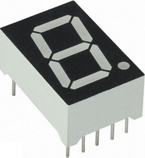
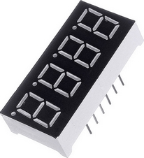
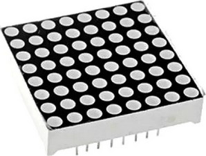

#   segment displays

-   offers:
    -   7-segment display
        -   can be combined with bitshift registers
    -   4 bit 7 segment display
        -   parallel and by I2C
    -   8x8 matrix display
        -   parallel and by SPI

### usage

| display | image | useful | requires an external library | additional informations |
| - | - | - | - | - |
| 7 segment display |  | to display a single character segment by segment | no | May come with a common cathode or common anode and this is hardly displayed anywhere. This can be determined only by connecting 5V to a segment with a resistor, like 220 ohm, and GND. If the segment shows up, then a common cathode is in use. A common anode requires the reversal setup and the certain segment does **not** show up, whereas the segments left shows up instead. |
| 4 bit 7 segment display |  | to display up to 4 single characters | any external library, which handles this segment | If this comes with a parallel connection, you need at least 12 wires. If this model comes with I2C connection, you only need 4 wires. Comes also with the option for a common cathode or common anode. |
| 8x8 dotted matrix |  | play with 64 single dots | no | The 8x8 matrix may come with 16 pins, where 8 pins at least needs a 220 - 330 ohm resistor. It doesn't matter which pins are connected trough a resistor. Furthermore this may come with a common cathode or common anode, so you may also needs an inverted matrix to display. Alternatively the 8x8 dotted matrix may also come with SPI. In that case you only need 5 wires without an external resistor. 