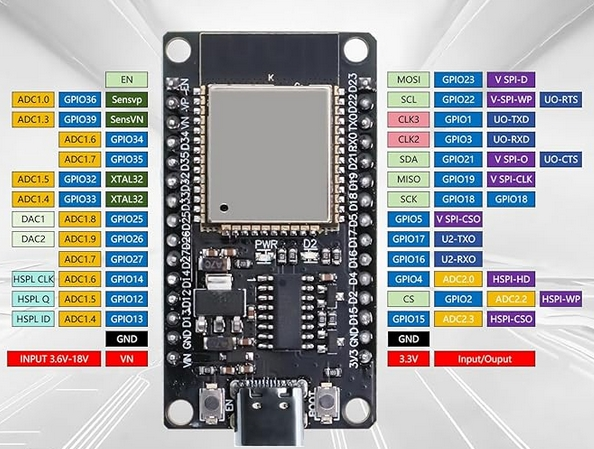

#   ESP32 microcontroller tutorial

-   contains simple projects for an Espressif ESP32 dual core microcontroller
    -   2 cores
    -   up to 240 MHz
    -   comes with Wi-Fi / Bluetooth communications
    -   very popular and versitile usages for home, study, industry, ...
    -   can be plugged in by USB (USB-C or mini-USB) or by using the power pin VIN or 3.3V

>   **NOTE**:   An "ESP32" does not mean, that every ESP32 might be identical to each other. It depends on the manufactory, number of pins, pins arrangement, etc., thus based on the given examples it depends on you how **you** use your ESP32 microcontroller.

>   **NOTE**:   An ESP32 operates only with 3.3V (may come with a tolerance range of 3.0 - 3.6V, which depends on the manufactory). Using 5V or more or less than 3.3V may damage your microcontroller or the microcontroller won't be able to use of too low power.
>>  The pin VIN **can** be used with 5V, but the remaining GPIO pins should **NEVER** be connected with a power supply outside of 3.3V, otherwise an undefined behavior on the microcontroller code or on the microcontroller or the plugged in components may appear at any time anywhere.

##  Specifications

#####   this ESP32 microcontroller is in use:
[used ESP32: NodeMCU ESP32](https://www.amazon.de/Entwicklungsplatine-QIQIAZI-ESP32-WROOM-32-Bluetooth-Dual-Cores/dp/B0DHRV7784/ref=sr_1_6?__mk_de_DE=%C3%85M%C3%85%C5%BD%C3%95%C3%91&crid=2G913ZOU76QQJ&dib=eyJ2IjoiMSJ9.0HQysaHgEqFjRs7m20z3kJrI_4wHjZlp7x6K1Czwy4iWQr7bQfz4u1YCzqsbju7MI6dTYrN7nEKxJcDBT7dvsfnXaAIBtA1CzQ9p-dZCTkNejFTq_nuEOGWgJi80QYfKA7OW-84RM5igOU8joE1jnsPrWq-BI-eVUeeqT4lsSELZCrBARjo2OU8hBfoYqqmjtA5LuW77t_t7AUY4SCHEZX5UEt2V_UzZG5xFhw46R9xO8hJ-i5iWP7ud7H77YEM0kRS1nXsDorpLf18EdNh9fkAv6fiEVrSNwxTN-8hnnWU.Kv55C2EuV5xTjKVMktxhQ7TPKtgS5FDa6sUhnAurMCQ&dib_tag=se&keywords=ESP32&qid=1775036191&sprefix=esp32%2Caps%2C117&sr=8-6)
